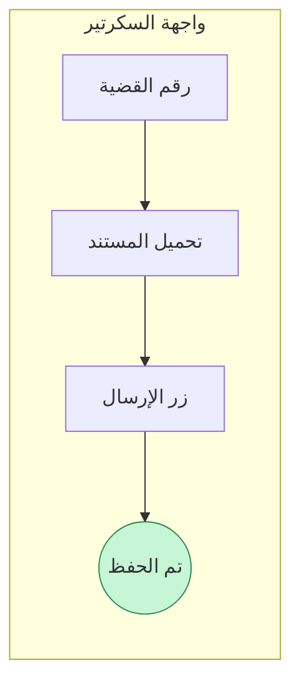
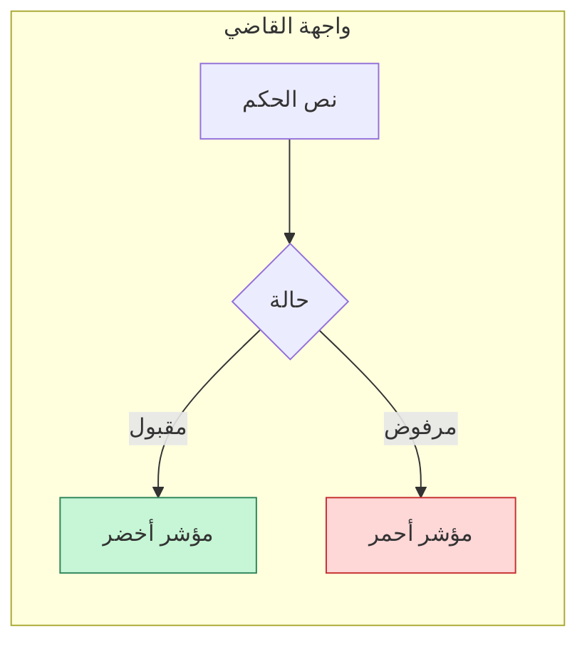
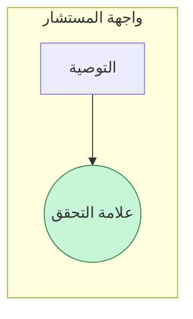
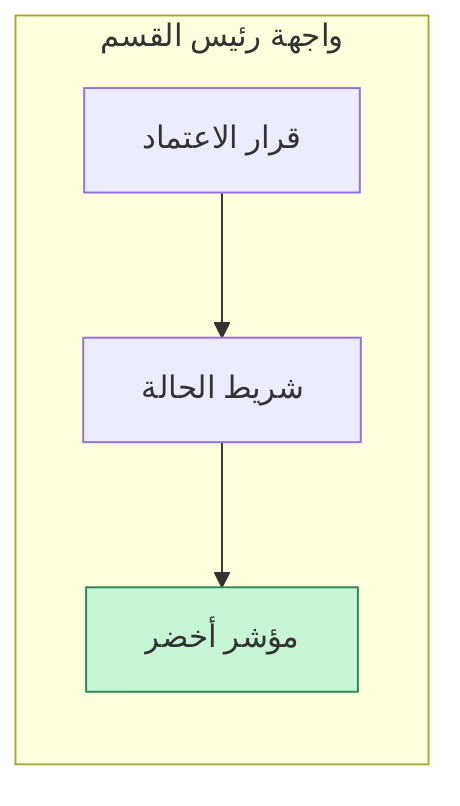
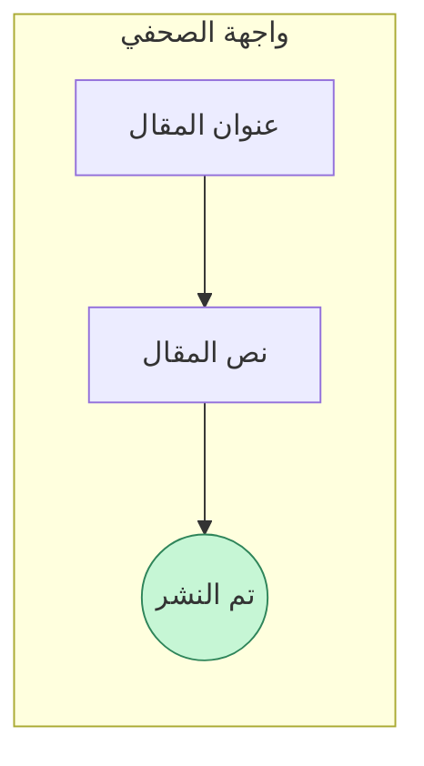

# دليل مراحل العمل

هذا الدليل يشرح مراحل سير العمل من السكرتير إلى الصحفي ويبين الحقول الإلزامية لكل مرحلة، أمثلة الإدخال وصيغ الملفات المدعومة، إضافة إلى مخططات للواجهات والمؤشرات البصرية.

## المخطط العام للمراحل


## السكرتير
### الحقول الإلزامية
- رقم القضية
- تاريخ الإدخال
- المستندات المرفوعة

### مثال إدخال
```json
{
  "caseNumber": "2024-001",
  "submissionDate": "2024-05-20",
  "documents": ["petition.pdf"]
}
```

### صيغ الملفات
- PDF
- DOCX

### مخطط الواجهة والمؤشرات


## القاضي
### الحقول الإلزامية
- رقم القضية
- نص الحكم
- حالة الحكم

### مثال إدخال
```json
{
  "caseNumber": "2024-001",
  "verdict": "قبول الدعوى",
  "status": "approved"
}
```

### صيغ الملفات
- TXT
- PDF

### مخطط الواجهة والمؤشرات


## المستشار
### الحقول الإلزامية
- رقم القضية
- التوصية
- التعليقات

### مثال إدخال
```json
{
  "caseNumber": "2024-001",
  "recommendation": "عرض القضية على رئيس القسم",
  "notes": "تمت المراجعة"
}
```

### صيغ الملفات
- MD
- PDF

### مخطط الواجهة والمؤشرات


## رئيس القسم
### الحقول الإلزامية
- رقم القضية
- قرار الاعتماد
- ملخص نهائي

### مثال إدخال
```json
{
  "caseNumber": "2024-001",
  "approval": true,
  "summary": "الموافقة على النشر"
}
```

### صيغ الملفات
- PDF
- HTML

### مخطط الواجهة والمؤشرات


## الصحفي
### الحقول الإلزامية
- رقم القضية
- عنوان المقال
- نص المقال

### مثال إدخال
```json
{
  "caseNumber": "2024-001",
  "title": "القضية تتصدر العناوين",
  "body": "نص المقال النهائي..."
}
```

### صيغ الملفات
- MD
- HTML

### مخطط الواجهة والمؤشرات


